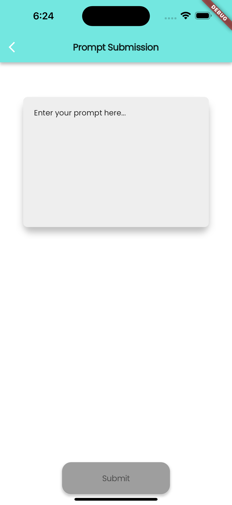
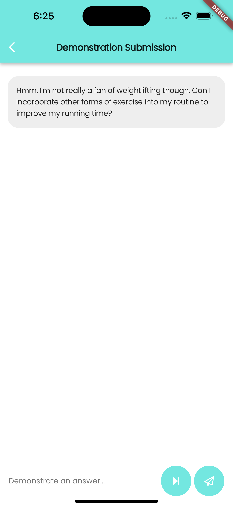
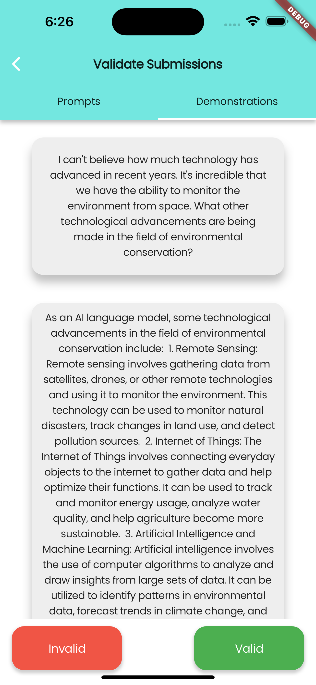

# GPTuner
A mobile-based data collection system for Large Language Models (LLMs). Users could submit prompts, demonstrate an answer to a prompt, and validate answers from other users to a given prompt and earn trophies on the app. 

    
    
    

### Motivation

The purpose of this app is to collect human feedback necessary to improve the reliability, accuracy, and harmlessness of fine-tuned LLMs. The collected feedback is then fed into a pipeline that aggregates the data and calculates the scalar reward to improve the model further.

### Description

This whole project is a mobile application built on Flutter frontend and Express+Node.js backend with MongoDB database. This repository is the frontend code for the project.

### Credits

I seeded my database with some initial data from a dataset. Credits to the dataset I used:

Authors: Ding, Ning and Chen, Yulin and Xu, Bokai and Hu, Shengding and Qin, Yujia and Liu, Zhiyuan and Sun, Maosong and Zhou, Bowen

Title: UltraChat: A Large-scale Auto-generated Multi-round Dialogue Data

Year: 2023

[Link](https://github.com/thunlp/ultrachat)
